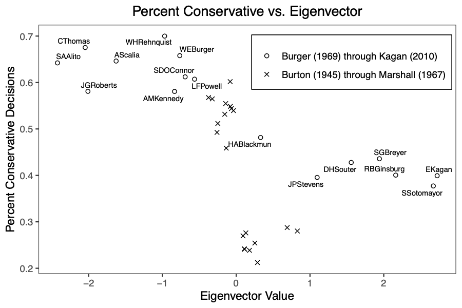
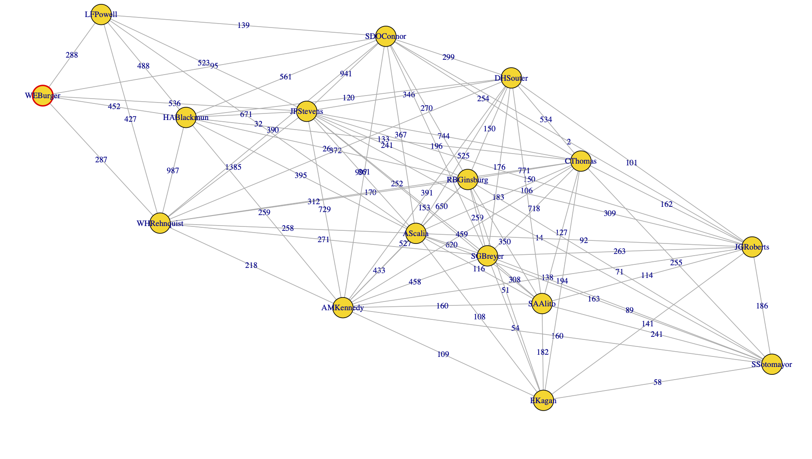

Disagreement Networks
==========

## with Brian Zilli
to appear in ['Involve'](https://msp.org/involve/about/journal/about.html)

<!-- -->

***

###Disagreement Network

<!-- -->

[Spaeth, Harold J.; Epstein, Lee; Martin, Andrew D.; Segal, Jeffrey A.; Ruger, Theodore J.; Benesh, Sara C. 2018 Supreme Court Database, Version 2018 Release 02.] (http://supremecourtdatabase.org)

