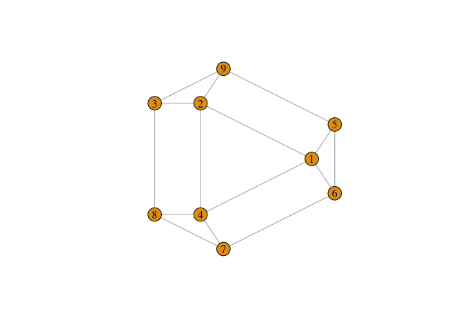

Spectral Graph Theory Demonstration
================

### Isaac Moorman


Supported by the National Science Foundation under Grant Number NSF
DMS-1700176.

## Introduction

A demonstration of how spectral graph theory can be used to better
visualize graphs and be used to identify planar graphs (graphs that can
be drawn with no overlapping edges).

## An example using iGraph in R

The only library needed is the iGraph library for network analysis and
visualization

``` r
library(igraph)
```

    ## 
    ## Attaching package: 'igraph'

    ## The following objects are masked from 'package:stats':
    ## 
    ##     decompose, spectrum

    ## The following object is masked from 'package:base':
    ## 
    ##     union

Using a sample generated graph G, consisting of nodes and edges, we can
see its difficult to determine whether the graph is planar

``` r
plot.igraph(g,  layout = l)
```

<!-- -->

First we can take the adjcency matrix of G, which shows which nodes are
connected to each other

``` r
adj <- as_adjacency_matrix(g)
adj
```

    ## 9 x 9 sparse Matrix of class "dgCMatrix"
    ##                        
    ##  [1,] . 1 . 1 1 1 . . .
    ##  [2,] 1 . 1 1 . . . . 1
    ##  [3,] . 1 . . . . . 1 1
    ##  [4,] 1 1 . . . . 1 1 .
    ##  [5,] 1 . . . . 1 . . 1
    ##  [6,] 1 . . . 1 . 1 . .
    ##  [7,] . . . 1 . 1 . 1 .
    ##  [8,] . . 1 1 . . 1 . .
    ##  [9,] . 1 1 . 1 . . . .

Then we can take the eigenvectors of this adjacency matrix

``` r
ev<-eigen(adj)
vectors<-ev$vectors
vectors
```

    ##             [,1]        [,2]       [,3]       [,4]        [,5]       [,6]
    ##  [1,] -0.4082483  0.36514837  0.0000000  0.4082483 -0.36514837  0.0000000
    ##  [2,] -0.4082483 -0.18257419  0.3162278  0.4082483  0.18257419  0.3162278
    ##  [3,] -0.2886751 -0.40824829  0.3162278 -0.2886751 -0.40824829  0.3162278
    ##  [4,] -0.4082483 -0.18257419 -0.3162278  0.4082483  0.18257419 -0.3162278
    ##  [5,] -0.2886751  0.47798542  0.1954395 -0.2886751 -0.06973713 -0.5116673
    ##  [6,] -0.2886751  0.47798542 -0.1954395 -0.2886751 -0.06973713  0.5116673
    ##  [7,] -0.2886751 -0.06973713 -0.5116673 -0.2886751  0.47798542  0.1954395
    ##  [8,] -0.2886751 -0.40824829 -0.3162278 -0.2886751 -0.40824829 -0.3162278
    ##  [9,] -0.2886751 -0.06973713  0.5116673 -0.2886751  0.47798542 -0.1954395
    ##                [,7]       [,8]        [,9]
    ##  [1,]  6.324555e-01  0.0000000  0.00000000
    ##  [2,] -3.162278e-01 -0.3111762 -0.45074314
    ##  [3,]  0.000000e+00  0.5434149  0.06855839
    ##  [4,] -3.162278e-01  0.3111762  0.45074314
    ##  [5,] -3.162278e-01  0.2322387 -0.38218475
    ##  [6,] -3.162278e-01 -0.2322387  0.38218475
    ##  [7,]  3.162278e-01  0.2322387 -0.38218475
    ##  [8,] -9.714451e-17 -0.5434149 -0.06855839
    ##  [9,]  3.162278e-01 -0.2322387  0.38218475

Using the second and third eigenvectors of the adjacency matrix as
cartesian coordinates for each node, we can plot the G with this layout.

We can see that G is planar, and now G also becomes a much clearer, more
practical graph to deal with.

``` r
v2<-vectors[,2]
v3<-vectors[,3]

v2<-vectors[,2]
v3<-vectors[,3]

j<-cbind(v2,v3)

plot.igraph(g, layout = j)
```

<!-- -->

\[Spielman, Daniel. “Miracles of Algebraic Graph Theory.” Joint Math
Meetings 2019, AMS-MAA, 18 Jan. 2019, Baltimore Convention Center\]

\[ K. M. Hall, “An r-dimensional Quadratic Placement Algorithm”,
Management Science 17 (1970), 219–229.\]
